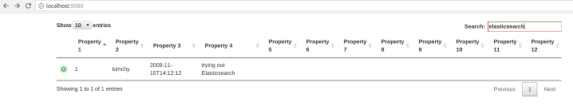
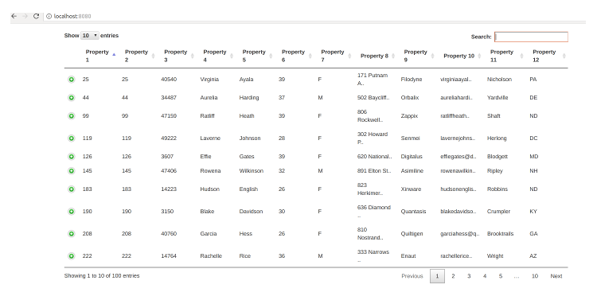
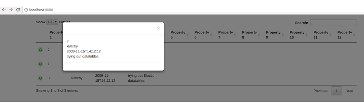

# elastic-datatables

An elasticsearch datatables prototype that can be forked and customised to provide search functionality on elastic indexes

## Components

1. Spring Boot
2. Bootstrap  https://getbootstrap.com/
3. Datatables https://datatables.net/
4. Custom code 

## Flow

1. Search - comes back with records
2. Details - Record details are displayed in the datatable 
3. Drill down - More details are displayed by clicking individual records

### Search



### Details



### Drill down




## Building

Ensure that you have access to the repositories hosting the dependencies mentioned in the pom.xml

mvn clean package

## Testing

1. Start an elastcsearch docker container

sudo docker run -p 9200:9200 -it --rm --name elasticsearch elasticsearch

2. Post a few msgs to elasticsearch using curl

```curl
curl -X PUT "localhost:9200/test/doc/1" -H 'Content-Type: application/json' -d'
{
    "user" : "kimchy",
    "post_date" : "2009-11-15T14:12:12",
    "message" : "trying out Elasticsearch"
}
'

curl -X PUT "localhost:9200/test/doc/2" -H 'Content-Type: application/json' -d'
{
    "user" : "kimchy",
    "post_date" : "2009-11-15T14:12:12",
    "message" : "trying out datatables"
}
'

curl -X PUT "localhost:9200/test/doc/3" -H 'Content-Type: application/json' -d'
{
    "user" : "kimchy",
    "post_date" : "2009-11-15T14:12:12",
    "message" : "trying out Elastic datatables"
}
'

```

3. Import project to Intellij and run EldApplication 

TODO: Run from command line

4. Navigate to http://localhost:8080 to see and interact with the user interface

## Debugging

Run the EldApplicaton in debug mode


## Customisation

Fork the repo and customise to your needs.

**In most cases you only have to change 1 file (application.properties) to include the search paths **

### Configuration
1. URL pointing to elastic search cluster index ( application.properties )
2. Generic Query Json (matchAll.json)
3. Specific Query Json (matchTerm.json)

### Code
1. Tailor the index.html to match your needs 
2. Tailor the ElasticResultSetProvider to match your needs
3. Change the application.properties file to point to your index
4. Change the application.properties file to use your format "properties1"..
