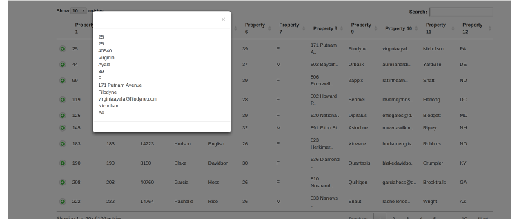

# elastic-datatables

An elasticsearch datatables component that can be forked and customised to provide search functionality on elastic indexes.

So if there are many indexes storing data in different json formats, fork the code, customise **application.properties** and start analysing the data.

## Components

1. Spring Boot
2. Bootstrap
3. DataTables
4. Custom code 

## Flow

1. Search - comes back with records
2. Details - Record details are displayed in the datatable 
3. Drill down - More details are displayed by clicking individual records

### Search


### Details


### Drill down




## Building

Ensure that you have access to the repositories hosting the dependencies mentioned in the pom.xml

```shell
mvn clean package
```

## Testing

1. Start an elastcsearch docker container

```shell
docker run -p 9200:9200 -it --rm --name elasticsearch elasticsearch
```

2. Post test data to elasticsearch using curl

```shell
cd testdata
curl -H 'Content-Type: application/x-ndjson' -XPOST 'localhost:9200/test/account/_bulk?pretty' --data-binary @accounts.json
```

3. Run EldApplication 

```shell
java -jar target/elastic-datatables-0.0.1-SNAPSHOT.jar
```

4. Navigate to http://localhost:8080 to see and interact with the user interface

### Testing a larger dataset

1. Upload shakespeare.json from the Kibana sample dataset
2. Add the below configuration to application.properties
```props
# The Elasticsearch URL
searchUrl=http://localhost:9200/shakespeare/_search?pretty&filter_path=hits.hits._id,hits.hits._type,hits.hits._source
# Mapping json to property
property1=._id
property2=._source.line_id
property3=._source.play_name
property4=._source.speech_number
property5=._source.line_number
property6=._source.speaker
property7=._source.text_entry
property8=
property9=
property10=
property11=
property12=
# Column Names
column1=Id
column2=Line Id
column3=Play Name
column4=Speech Number
column5=Line Number
column6=Speaker
column7=Text Entry
column8=
column9=
column10=
column11=
column12=
```
3. Build and run the application
4. Navigate to http://localhost:8080 to see and interact with the user interface

## Debugging

Run the EldApplication in debug mode in IDE


## Customisation

Fork the repo and customise to your needs.

** In most cases you only have to change 1 file (application.properties) to include the search paths and column names **

### Configuration
1. URL pointing to elastic search cluster index ( application.properties )
2. Change the application.properties file to use your format "properties1"..
3. Generic Query Json (matchAll.json)
4. Specific Query Json (matchTerm.json)

### Code
1. Tailor the index.html to match your needs 
2. Tailor the ElasticResultSetProvider to match your needs

### Other Providers

The current provider is Elasticsearch, but you can plugin any provider (database, caches ..) that confirms to the ResultSetProvider interface

## TODO's

1. Implement ordering
2. Add shas to all javascript files
