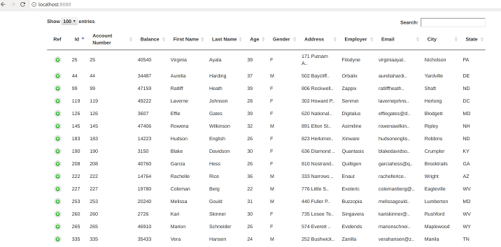

# elastic-datatables

An elasticsearch datatables prototype that can be forked and customised to provide search functionality on elastic indexes

## Components

1. Spring Boot
2. Bootstrap
3. Datatables
4. Custom code 

## Flow

1. Search - comes back with records
2. Details - Record details are displayed in the datatable 
3. Drill down - More details are displayed by clicking individual records

### Search


### Details



### Drill down


## Building

Ensure that you have access to the repositories hosting the dependencies mentioned in the pom.xml

mvn clean package

## Testing

1. Start an elastcsearch docker container

docker run -p 9200:9200 -it --rm --name elasticsearch elasticsearch

2. Post test data to elasticsearch using curl

```curl
cd testdata
curl -H 'Content-Type: application/x-ndjson' -XPOST 'localhost:9200/test/account/_bulk?pretty' --data-binary @accounts.json
```

3. Import project to Intellij and run EldApplication 

4. Navigate to http://localhost:8080 to see and interact with the user interface

## Debugging

Run the EldApplicaton in debug mode


## Customisation

Fork the repo and customise to your needs.

**In most cases you only have to change 1 file (application.properties) to include the search paths **

### Configuration
1. URL pointing to elastic search cluster index ( application.properties )
2. Change the application.properties file to use your format "properties1"..
3. Generic Query Json (matchAll.json)
4. Specific Query Json (matchTerm.json)

### Code
1. Tailor the index.html to match your needs 
2. Tailor the ElasticResultSetProvider to match your needs

## TODs

1. Run from command line
2. Implement ordering
3. Add shas to all javascript files
4. Column names from application.properties file
